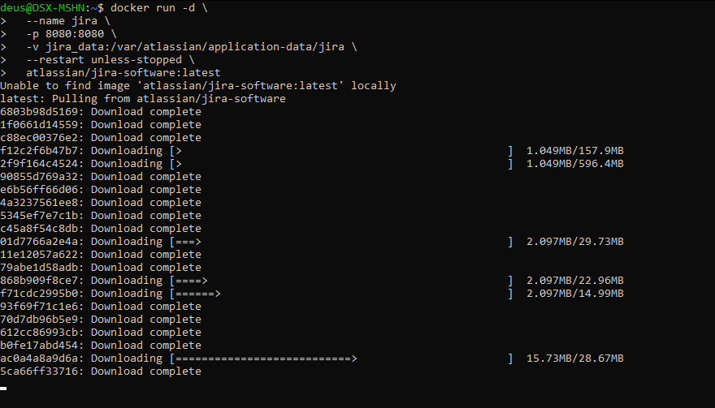
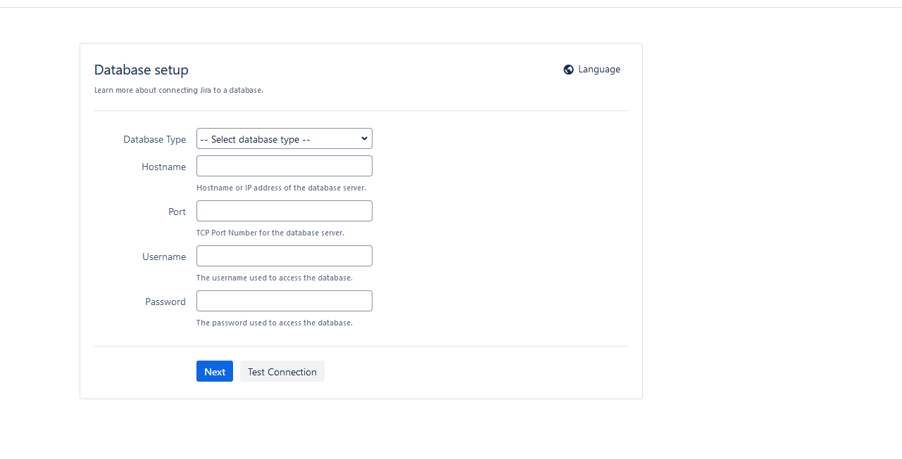

# Jira в Docker

## О проекте

**Jira** — коммерческая система для отслеживания ошибок и управления проектами, разработанная австралийской компанией Atlassian . Название происходит от японского «Gojira» (Годзилла), что символизирует мощный инструмент, призванный заменить устаревшую Bugzilla .

Сегодня Jira — универсальная платформа для управления задачами, которую используют не только разработчики, но и маркетологи, HR-специалисты и производственные компании .

### Ключевые возможности

- Поддержка Agile-методологий (Scrum и Kanban)
- Управление задачами (тикетами) от создания до закрытия
- Отслеживание ошибок (баг-трекинг)
- Инструменты аналитики и отчетов
- Более 6000 интеграций с другими сервисами

## Установка Jira

```bash
docker run -d \
  --name jira \
  -p 8080:8080 \
  -v jira_data:/var/atlassian/application-data/jira \
  --restart unless-stopped \
  atlassian/jira-software:latest
```



### Что означают аргументы

| Аргумент | Описание |
| `-d` | Запуск в фоновом режиме |
| `--name jira` | Имя контейнера |
| `-p 8080:8080` | Проброс порта (стандартный порт Jira) |
| `-v jira_data:/var/atlassian/application-data/jira` | Том для хранения данных (проекты, настройки)  |
| `--restart unless-stopped` | Автоматический перезапуск |
| `atlassian/jira-software:latest` | Официальный образ Jira Software |

## Проверка работы

```url
http://localhost:8080
```


При первом входе система попросит настроить:

- Подключение к базе данных (рекомендуется PostgreSQL или MySQL)
- Лицензионный ключ (триальная версия доступна на сайте Atlassian)
- Учетную запись администратора

## Расширенная конфигурация

### С внешней базой данных PostgreSQL

```bash
docker network create jira-net

# Запуск PostgreSQL
docker run -d \
  --name jira-db \
  --network jira-net \
  -e POSTGRES_PASSWORD=secret \
  -e POSTGRES_USER=jiradb \
  -e POSTGRES_DB=jira \
  postgres:16

# Запуск Jira с подключением к БД
docker run -d \
  --name jira \
  --network jira-net \
  -p 8080:8080 \
  -v jira_data:/var/atlassian/application-data/jira \
  -e ATL_JDBC_URL="jdbc:postgresql://jira-db:5432/jira" \
  -e ATL_JDBC_USER=jiradb \
  -e ATL_JDBC_PASSWORD=secret \
  atlassian/jira-software:latest
```

### Настройка JVM для производительности

```bash
docker run -d \
  --name jira \
  -p 8080:8080 \
  -v jira_data:/var/atlassian/application-data/jira \
  -e JVM_MINIMUM_MEMORY=2g \
  -e JVM_MAXIMUM_MEMORY=4g \
  atlassian/jira-software:latest
```

### За прокси (nginx) с HTTPS

```bash
docker run -d \
  --name jira \
  -p 8080:8080 \
  -v jira_data:/var/atlassian/application-data/jira \
  -e ATL_PROXY_NAME=jira.example.com \
  -e ATL_PROXY_PORT=443 \
  -e ATL_TOMCAT_SCHEME=https \
  atlassian/jira-software:latest
```

## Полезные команды

```bash
# Просмотр логов
docker logs jira

# Подключение к bash внутри контейнера
docker exec -it jira bash

# Резервное копирование данных
docker run --rm -v jira_data:/data -v $(pwd):/backup alpine tar czf /backup/jira-backup-$(date +%Y%m%d).tar.gz -C /data .

# Остановка
docker stop jira

# Удаление (с сохранением тома)
docker rm jira

# Полное удаление (включая том)
docker rm -v jira
docker volume rm jira_data
```

## Системные требования

- **CPU**: от 2 ядер (рекомендуется 4+)
- **RAM**: от 4 ГБ (рекомендуется 8 ГБ)
- **Диск**: от 10 ГБ для данных
- **ОС**: Linux, macOS, Windows с поддержкой Docker

## Лицензирование

Jira — коммерческий продукт :

- **Free** — до 10 пользователей (бесплатно)
- **Standard** — $7/пользователя в месяц
- **Premium** — $14/пользователя в месяц
- **Enterprise** — индивидуально для крупных компаний

Для проектов с открытым кодом Atlassian предоставляет специальные бесплатные лицензии .

## Примечания

- Для продакшена обязательно используйте внешнюю базу данных
- Регулярно делайте бэкапы тома с данными
- Настройте регулярное обновление образа для получения патчей безопасности
- Для работы с SSL рекомендуется использовать reverse proxy (nginx)
