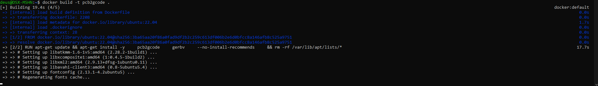
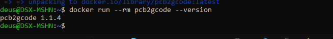

# pcb2gcode в Docker

## О проекте

**pcb2gcode** — программа с открытым исходным кодом для преобразования Gerber-файлов (стандартный формат для печатных плат) в G-code для станков с ЧПУ . Позволяет изготавливать печатные платы методом фрезерования, гравировки или с использованием лазера .

Программа автоматически генерирует управляющие команды для:

- Изоляции дорожек (фрезеровка меди вокруг проводников)
- Сверления отверстий
- Вырезания контура платы
- Гравировки (включая UV-лазеры для 3D-принтеров)

## Доступные Docker-образы

### Официальный образ (сборка из исходников)

Официального образа на Docker Hub нет, но можно собрать из исходников используя `Dockerfile`. Пример сборки:

```dockerfile
FROM ubuntu:22.04

RUN apt-get update && apt-get install -y \
    pcb2gcode \
    gerbv \
    libgeos-dev \
    && rm -rf /var/lib/apt/lists/*
```

### Сторонние образы

Существуют пользовательские сборки, например **ngargaud/insolante** — веб-обертка для pcb2gcode :

```bash
docker pull ngargaud/insolante:1.4.1-armhf
```

## Установка (сборка образа)

```bash
# Создать Dockerfile
cat > Dockerfile << 'EOF'
FROM ubuntu:22.04

RUN apt-get update && apt-get install -y \
    pcb2gcode \
    gerbv \
    --no-install-recommends \
    && rm -rf /var/lib/apt/lists/*

ENTRYPOINT ["pcb2gcode"]
EOF

# Собрать образ
docker build -t pcb2gcode .

# Проверить версию
docker run --rm pcb2gcode --version
```




## Использование

### Базовый запуск

```bash
docker run --rm \
  -v $(pwd):/data \
  pcb2gcode \
  --front=/data/front.gbr \
  --back=/data/back.gbr \
  --drill=/data/drills.excellon \
  --out=/data/output
```

### Что означают аргументы

| Аргумент Docker | Описание |
|:----------------|:---------|
| `--rm` | Удалить контейнер после выполнения |
| `-v $(pwd):/data` | Монтирует текущую папку в `/data` внутри контейнера |

| Аргумент pcb2gcode | Описание |
|:----------------|:---------|
| `--front=file.gbr` | Gerber-файл верхнего слоя |
| `--back=file.gbr` | Gerber-файл нижнего слоя |
| `--drill=file.drl` | Файл сверловки (Excellon) |
| `--out=директория` | Папка для выходных G-code файлов |
| `--metric` | Использовать метрическую систему |
| `--zwork=0.1` | Глубина рабочего прохода (мм) |
| `--zsafe=2.0` | Безопасная высота перемещений |

### Пример для лазерной гравировки

```bash
docker run --rm \
  -v $(pwd):/data \
  pcb2gcode \
  --front=/data/gerber/gpl/*.gbr \
  --back=/data/gerber/gbl/*.gbr \
  --out=/data/output \
  --laser \
  --dpi=1000
```

## Веб-интерфейс Insolante

Существует Docker-образ с веб-оберткой для pcb2gcode:

```bash
docker run -d \
  --name insolante \
  -p 5000:5000 \
  -v /mnt/data:/opt/core/data \
  ngargaud/insolante:1.4.1-armhf
```

### Параметры Insolante

| Переменная | Назначение |
|:----------------|:---------|
| `-p 5000:5000` | Проброс порта веб-интерфейса |
| `-v /mnt/data:/opt/core/data` | Том для проектов |
| `-e URL=example.com` | Внешний URL для websockets |
| `-e RPORT=5000` | Публичный порт |
| `-e DEBUG=true` | Режим отладки |

После запуска веб-интерфейс доступен по адресу:

```url
http://localhost:5000
```

Интерфейс предоставляет вкладки для разных этапов обработки :

- **gcode position** — перемещение головы для позиционирования платы
- **gcode back side** — G-code для нижней стороны
- **gcode removal** — очистка остатков смолы

## Примечания по зависимостям

При сборке могут возникнуть проблемы с версиями библиотек. Например, pcb2gcode v2.5.0 требует определенную версию libgeos :

```dockerfile
# Возможное решение для libgeos
RUN apt-get install -y libgeos-dev && \
    ln -s /usr/lib/x86_64-linux-gnu/libgeos.so /usr/lib/libgeos.so.3.12.0
```

## Полезные команды

```bash
# Интерактивный режим
docker run --rm -it -v $(pwd):/data pcb2gcode bash

# Справка по параметрам
docker run --rm pcb2gcode --help

# Удаление образа
docker rmi pcb2gcode
```
