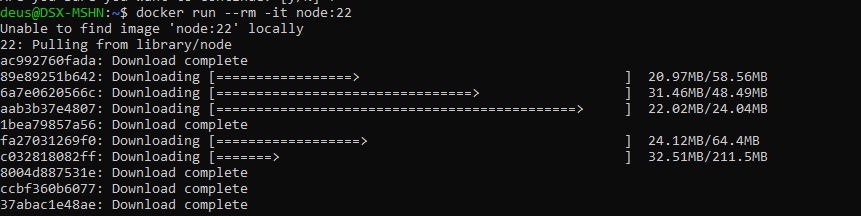

```markdown
# Node.js в Docker

## О проекте

**Node.js** — любимая среда выполнения JavaScript на сервере, построенная на движке V8 от Google. Позволяет создавать масштабируемые сетевые приложения!!!!

## Официальные образы

```bash
# Разные версии
node:22       # последняя стабильная
node:20       # LTS версия
node:18       # старая LTS
node:alpine   # минимальный образ (Alpine Linux)
node:slim     # уменьшенный Debian
```

## Базовый запуск

```bash
# Интерактивная сессия Node.js
docker run --rm -it node:22

# Запуск скрипта из файла
docker run --rm -v $(pwd):/app -w /app node:22 node script.js
```

## Для приложения

```bash
# Запуск приложения с package.json
docker run -d \
  --name my-app \
  -p 3000:3000 \
  -v $(pwd):/app \
  -w /app \
  node:22 \
  npm start
```

## Простой Dockerfile

```dockerfile
FROM node:22-alpine
WORKDIR /app
COPY package*.json ./
RUN npm ci --only=production
COPY . .
EXPOSE 3000
CMD ["node", "server.js"]
```

```bash
docker build -t my-app .
docker run -d -p 3000:3000 --name my-app my-app
```

## Переменные окружения

```bash
docker run -d \
  -p 3000:3000 \
  -e NODE_ENV=production \
  -e PORT=3000 \
  -e DB_URL=mongodb://... \
  --name my-app \
  my-app
```

## Для разработки (с hot-reload)

```bash
docker run -d \
  -p 3000:3000 \
  -v $(pwd):/app \
  -v /app/node_modules \
  -w /app \
  node:22 \
  npm run dev
```

## Полезные команды

```bash
# Проверка версии
docker run --rm node:22 node --version
docker run --rm node:22 npm --version

# Установка глобальных пакетов
docker run --rm -v $(pwd):/app -w /app node:22 npm install -g create-react-app

# Выполнение в работающем контейнере
docker exec -it my-app sh
docker exec my-app npm test
```

## npm ci vs npm install

| Команда | Когда использовать |
|---------|-------------------|
| `npm ci` | Для продакшена (быстрее, строже) |
| `npm install` | Для разработки (обновляет package-lock) |

## Примечания

- Для продакшена используйте `node:22-alpine` (меньше уязвимостей)
- Всегда указывайте конкретную версию, не `latest`
- Монтируйте `node_modules` как том при разработке
- Для многоконтейнерных приложений используйте Docker Compose

```
