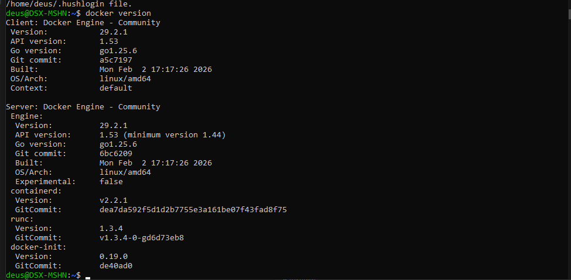
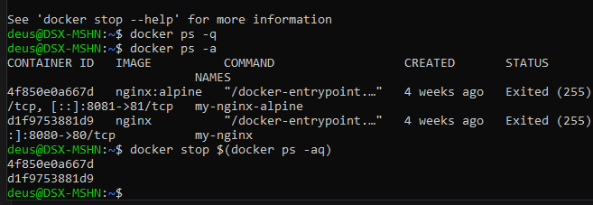
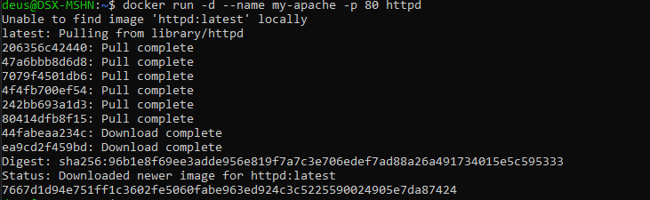
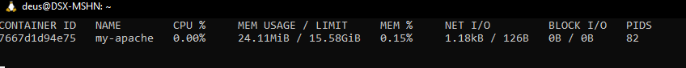
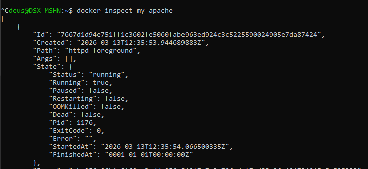
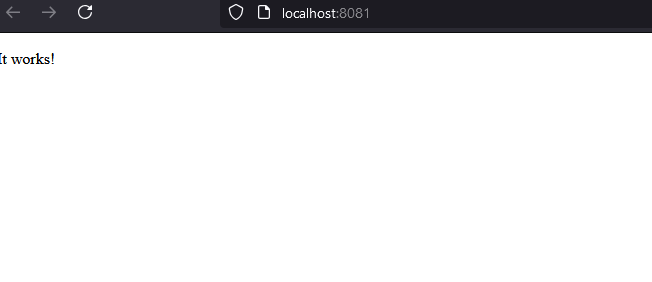
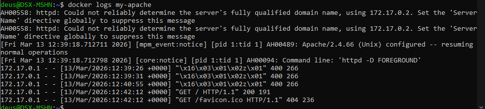

# Апач на докере

## Проверка Docker

```bash
docker version
```



## Проверка и удаление ранее установленных контейнеров

~~docker stop $(docker ps -q)~~

```bash
docker ps -a
docker stop $(docker ps -aq)
docker container prune
```



## Находим образ и запускаем

```bash
docker run -d --name my-apache -p 8081:80 httpd
```



## Проверяем

```bash
docker stats
```



## И снова проверяем

```bash
docker inspect my-apache
```



## В браузере работает



## Логи

```bash
docker logs my-apache
```


