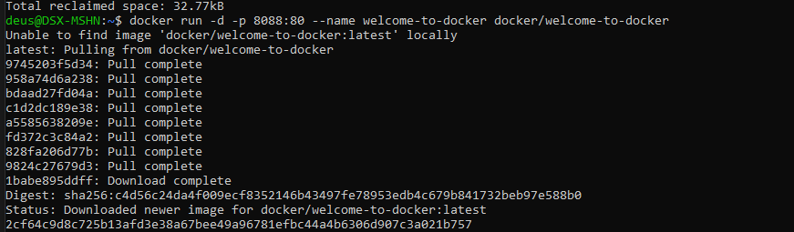
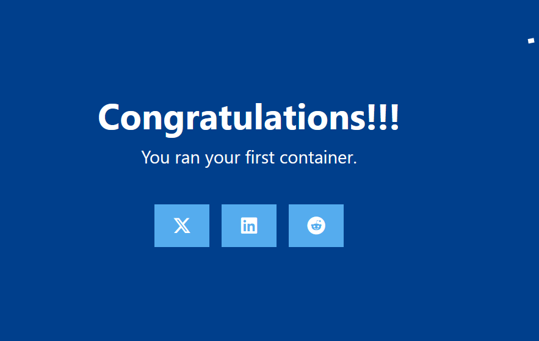
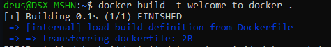

# Welcome to Docker

## Попробуем

Выполняем команду:

```bash
docker run -d -p 8088:80 --name welcome-to-docker docker/welcome-to-docker
```


Открываем в браузере:
<http://localhost:8088>


## Сборка

Сборка и запуск:

```bash
docker build -t welcome-to-docker .
docker run -d -p 8088:3000 --name welcome-to-docker welcome-to-docker
```


Откройте в браузере:
<http://localhost:8088>
