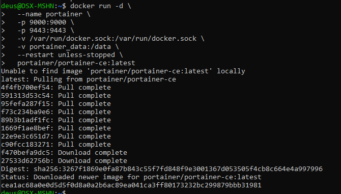
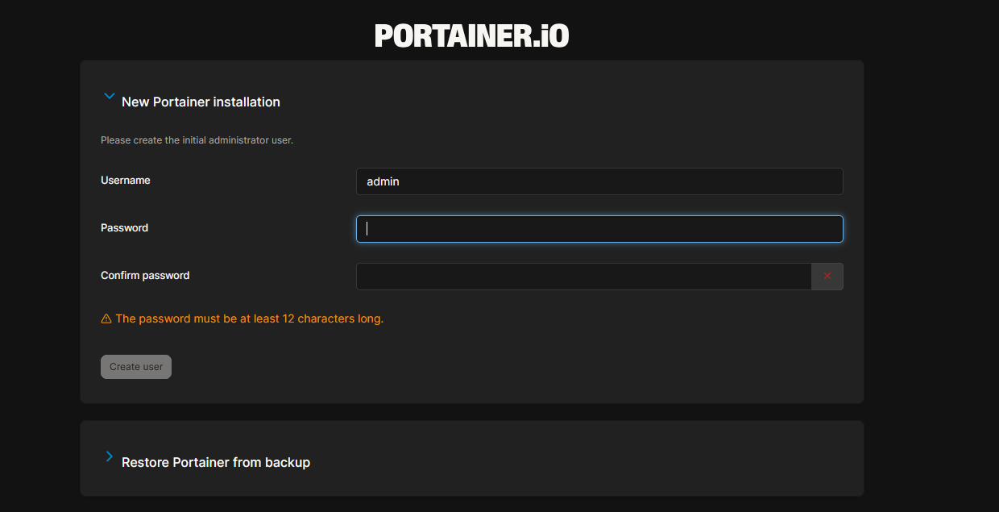

# Portainer

Portainer — это веб-интерфейс для управления Docker.

## Возможности

- Управление контейнерами, образами, сетями и томами
- Мониторинг ресурсов
- Управление несколькими Docker хостами
- Визуализация Docker окружения
- Управление правами доступа

## Версии

- **Community Edition (CE)** — бесплатная версия с открытым кодом
- **Business Edition (BE)** — платная версия с расширенными функциями

## Архитектура

Portainer состоит из двух компонентов:

- **Portainer Server** — основной сервер с веб-интерфейсом
- **Portainer Agent** — агент для управления удаленными хостами

## Доступ

После установки доступен по адресам:

- HTTP: `http://localhost:9000`
- HTTPS: `https://localhost:9443`

При первом входе создается пользователь admin.

## Требования

- Docker (любая современная версия)
- 1 CPU, 512 MB RAM (минимально)
- Открытые порты 9000 и/или 9443

## Установка Portainer

```bash
docker run -d \
  --name portainer \
  -p 9000:9000 \
  -p 9443:9443 \
  -v /var/run/docker.sock:/var/run/docker.sock \
  -v portainer_data:/data \
  --restart unless-stopped \
  portainer/portainer-ce:latest
```



## Что означают аргументы

| Аргумент | Описание |
|:----------|:----------|
| `-d` | Запуск в фоновом режиме (detached) |
| `--name portainer` | Имя контейнера |
| `-p 9000:9000` | Проброс HTTP порта (хост:контейнер) |
| `-p 9443:9443` | Проброс HTTPS порта |
| `-v /var/run/docker.sock...` | Подключение к Docker API на хосте |
| `-v portainer_data:/data` | Том для хранения данных |
| `--restart unless-stopped` | Автоматический перезапуск |
| `portainer/portainer-ce:latest` | Образ с тегом latest |

## Проверка подключения

```url
http://localhost:9000
```



## Полезные команды

```bash
# Просмотр логов
docker logs portainer

# Остановка
docker stop portainer

# Удаление
docker rm portainer

# Удаление с томом
docker rm -v portainer
