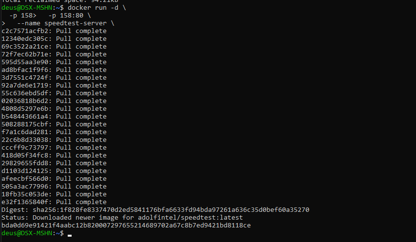
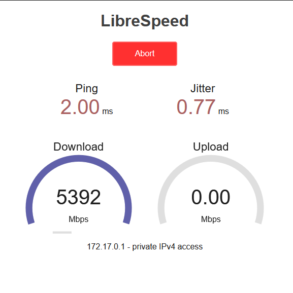
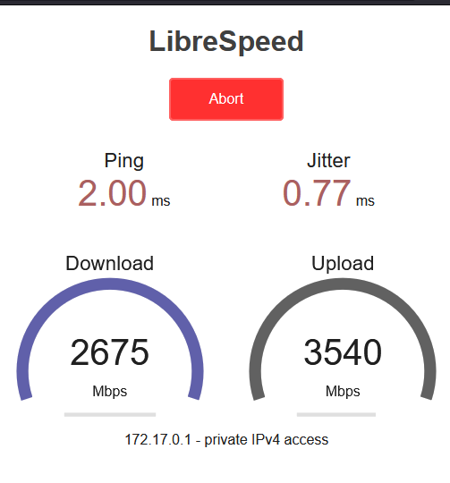
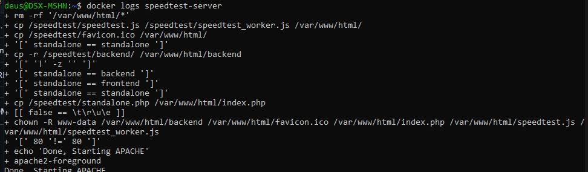
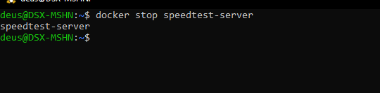
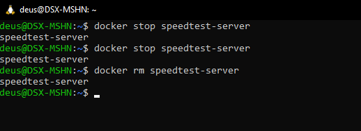

# Speedtest

Утилита для тестирования скорости интернет-соединения.

## О проекте

**Speedtest Server** — легковесный Docker-образ, который поднимает собственный сервер для проверки скорости. Основан на проекте LibreSpeed — открытой альтернативе Speedtest by Ookla.

Особенности:

- Не требует Java или Flash
- Работает на чистом JavaScript
- Не отправляет данные на сторонние серверы
- Можно использовать локально или внутри сети

## Установка Speedtest Server

```bash
docker run -d \
  -p 158:80 \
  --name speedtest-server \
  adolfintel/speedtest
```



### Что означают аргументы

| Аргумент | Описание |
|----------|----------|
| `-d` | Запуск в фоновом режиме |
| `-p 158:80` | Проброс порта (хост:контейнер) |
| `--name speedtest-server` | Имя контейнера |
| `adolfintel/speedtest` | Образ с сервером Speedtest |

## Проверка работы

Откройте в браузере:

```url
http://localhost:158
```



~~И вкладка падает~~

## Как это работает

1. Тест загрузки (Download) — браузер скачивает случайные данные с сервера
2. Тест отдачи (Upload) — браузер отправляет случайные данные на сервер
3. Ping и Jitter — измеряются служебными запросами

## Для чего используется

- Проверка реальной скорости интернета без внешних сервисов
- Тестирование локальной сети
- Измерение производительности между контейнерами
- ~~Проверка скорости диска~~ (нет, это тест сети, а не диска)

## Дополнительные команды

```bash
# Просмотр логов
docker logs speedtest-server

# Остановка
docker stop speedtest-server

# Удаление
docker rm speedtest-server
```


