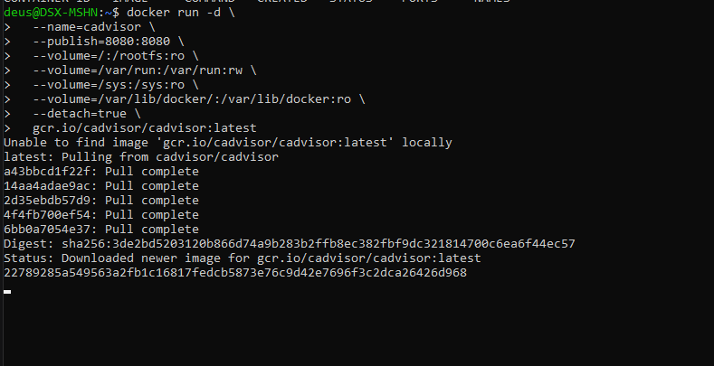
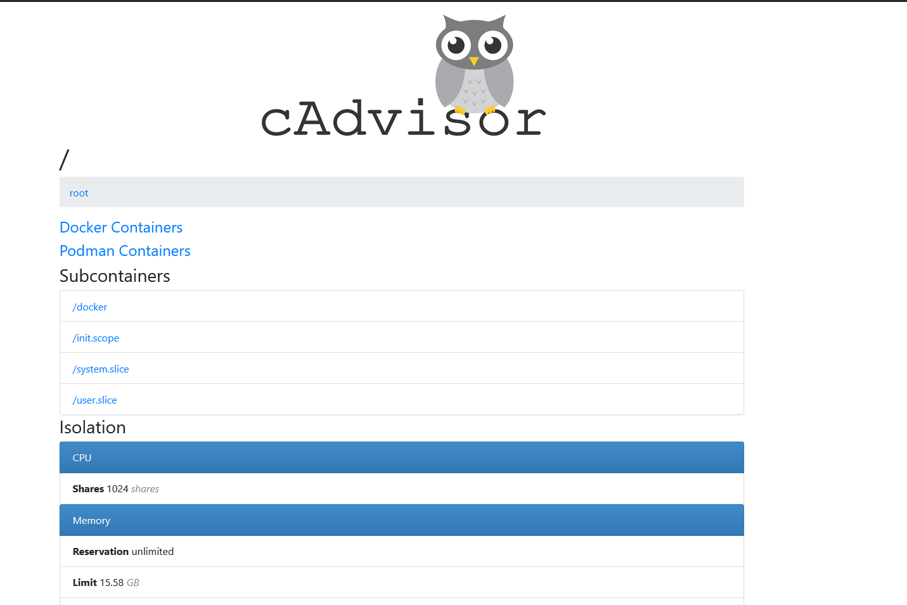
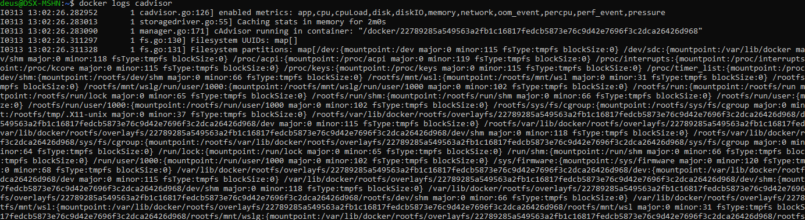
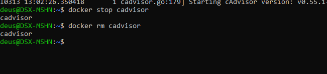

# cAdvisor (Container Advisor)

## О проекте

**cAdvisor** (Container Advisor) — открытый инструмент для мониторинга ресурсов и производительности контейнеров, разработанный Google .

Собирает, агрегирует и экспортирует информацию о запущенных контейнерах: параметры изоляции ресурсов, историю использования CPU, памяти, сети и файловой системы .

## Особенности

- Работает с различными runtime: Docker, CRI-O, containerd
- Автоматически обнаруживает новые контейнеры
- Минимальное потребление ресурсов (обычно <1% CPU)
- Экспорт метрик в формате Prometheus
- Веб-интерфейс для визуализации

## Установка cAdvisor

```bash
docker run -d \
  --name=cadvisor \
  --publish=8080:8080 \
  --volume=/:/rootfs:ro \
  --volume=/var/run:/var/run:rw \
  --volume=/sys:/sys:ro \
  --volume=/var/lib/docker/:/var/lib/docker:ro \
  --detach=true \
  gcr.io/cadvisor/cadvisor:latest
```



### Что означают аргументы

| Аргумент | Описание |
| `-d` | Запуск в фоновом режиме |
| `--name=cadvisor` | Имя контейнера |
| `-p 8080:8080` | Проброс порта (веб-интерфейс) |
| `--volume=/:/rootfs:ro` | Доступ к корневой ФС хоста (только чтение) |
| `--volume=/var/run:/var/run:rw` | Доступ к Docker socket |
| `--volume=/sys:/sys:ro` | Доступ к информации о системе |
| `--volume=/var/lib/docker:ro` | Доступ к данным Docker |

## Проверка работы

```url
http://localhost:8080
```



## Что можно увидеть в интерфейсе

- **CPU** — использование процессора (общее, по ядрам, user/system)
- **Memory** — RSS, cache, working set, page faults
- **Network** — входящий/исходящий трафик, ошибки
- **Filesystem** — чтение/запись, использование диска
- **Processes** — количество процессов в контейнере

## Для чего используется

- Мониторинг потребления ресурсов контейнерами в реальном времени
- Поиск "прожорливых" контейнеров
- Сбор метрик для Prometheus + Grafana
- Оптимизация размещения контейнеров
- Отладка производительности

## Дополнительные команды

```bash
# Просмотр логов
docker logs cadvisor

# Остановка
docker stop cadvisor

# Удаление
docker rm cadvisor

# Просмотр метрик в Prometheus формате
~~но это не точно~~
curl http://localhost:8080/metrics
```

## Примечания

- В Kubernetes cAdvisor встроен в kubelet
- Для RedHat/CentOS может потребоваться `--privileged=true`
- Debian может требовать включения memory cgroup
