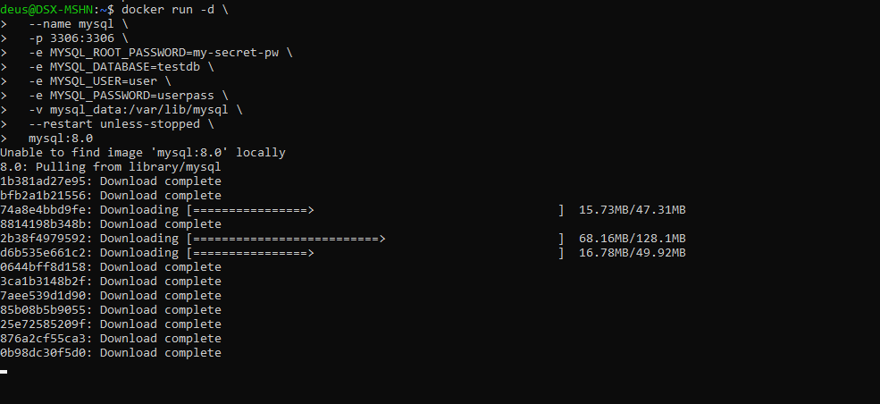
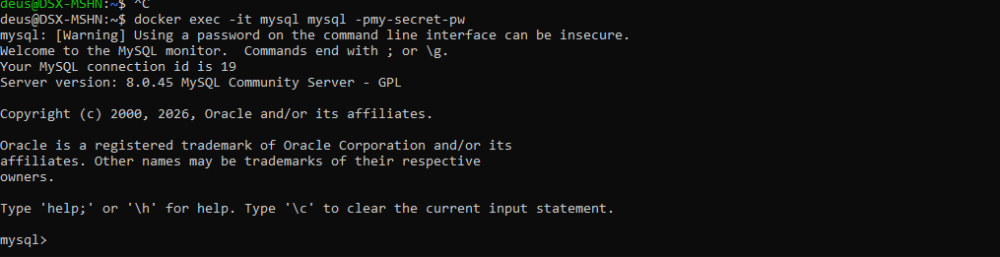
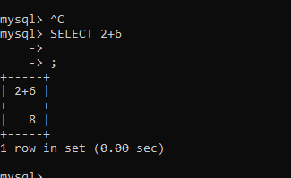
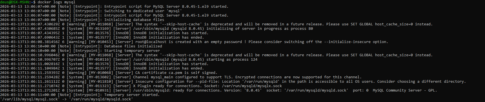
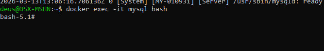
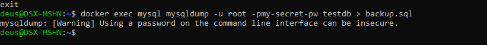
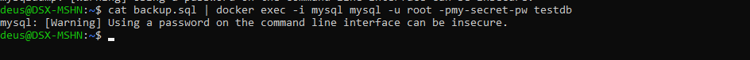
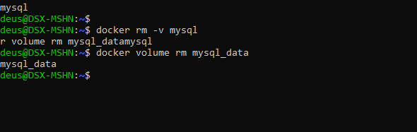

```markdown
# MySQL в Docker

## О проекте

**MySQL** — популярная реляционная база данных с открытым исходным кодом. Docker-образ позволяет быстро развернуть экземпляр MySQL без установки на хост-систему.

Особенности официального образа:
- Основан на Debian или Oracle Linux
- Поддержка различных версий (5.7, 8.0, 8.4, 9.0)
- Настраивается через переменные окружения
- Тома для постоянного хранения данных

## Установка MySQL

```bash
docker run -d \
  --name mysql \
  -p 3306:3306 \
  -e MYSQL_ROOT_PASSWORD=my-secret-pw \
  -e MYSQL_DATABASE=testdb \
  -e MYSQL_USER=user \
  -e MYSQL_PASSWORD=userpass \
  -v mysql_data:/var/lib/mysql \
  --restart unless-stopped \
  mysql:8.0
```



### Что означают аргументы

| Аргумент | Описание |
|----------|----------|
| `-d` | Запуск в фоновом режиме |
| `--name mysql` | Имя контейнера |
| `-p 3306:3306` | Проброс порта (стандартный порт MySQL) |
| `-e MYSQL_ROOT_PASSWORD=...` | Пароль для root пользователя (обязательно) |
| `-e MYSQL_DATABASE=testdb` | Создать БД при первом запуске |
| `-e MYSQL_USER=user` | Создать пользователя |
| `-e MYSQL_PASSWORD=userpass` | Пароль для созданного пользователя |
| `-v mysql_data:/var/lib/mysql` | Том для хранения данных |
| `--restart unless-stopped` | Автоматический перезапуск |
| `mysql:8.0` | Образ с тегом версии 8.0 |

## Проверка работы

```bash
# Подключиться к контейнеру
docker exec -it mysql mysql -p my-secret-pw
# Или с локального клиента
mysql -h 127.0.0.1 -P 3306 -u root -p
```



## Полезные команды

```bash
# Просмотр логов
docker logs mysql

# Подключение к bash внутри контейнера
docker exec -it mysql bash

# Резервное копирование БД
docker exec mysql mysqldump -u root -pmy-secret-pw testdb > backup.sql

# Восстановление из бэкапа
cat backup.sql | docker exec -i mysql mysql -u root -pmy-secret-pw testdb

# Остановка
docker stop mysql

# Удаление (с сохранением тома)
docker rm mysql

# Полное удаление (включая том)
docker rm -v mysql
docker volume rm mysql_data
```

## Переменные окружения

| Переменная | Назначение | Обязательная |
|------------|------------|--------------|
| `MYSQL_ROOT_PASSWORD` | Пароль для root | Да (или MYSQL_RANDOM_ROOT_PASSWORD) |
| `MYSQL_RANDOM_ROOT_PASSWORD` | Сгенерировать случайный пароль | Альтернатива |
| `MYSQL_DATABASE` | Создать БД при инициализации | Нет |
| `MYSQL_USER` | Создать пользователя | Нет |
| `MYSQL_PASSWORD` | Пароль для созданного пользователя | Если есть MYSQL_USER |
| `MYSQL_ALLOW_EMPTY_PASSWORD` | Разрешить пустой пароль root | Нет (опасно!) |

## Монтирование конфигурации

```bash
# С собственным my.cnf
docker run -d \
  --name mysql \
  -p 3306:3306 \
  -e MYSQL_ROOT_PASSWORD=my-secret-pw \
  -v ./my.cnf:/etc/mysql/my.cnf \
  -v mysql_data:/var/lib/mysql \
  mysql:8.0
```

## Пример my.cnf

```ini
[mysqld]
character-set-server=utf8mb4
collation-server=utf8mb4_unicode_ci
max_connections=200
innodb_buffer_pool_size=1G
```

## Подключение из другого контейнера

```bash
# В одной сети
docker network create my-network

docker run -d --network my-network --name mysql -e MYSQL_ROOT_PASSWORD=secret mysql:8.0

docker run -it --network my-network --name phpmyadmin -p 8080:80 phpmyadmin/phpmyadmin
```

## Для разработки (быстрый старт)

```bash
# Минимальный запуск
docker run -d --name mysql-dev -p 3306:3306 -e MYSQL_ALLOW_EMPTY_PASSWORD=true mysql:8.0

# С phpMyAdmin
docker run -d --name phpmyadmin -p 8080:80 --link mysql:db phpmyadmin/phpmyadmin
```

## Примечания

- Для продакшена обязательно меняйте пароли
- Регулярно делайте бэкапы
- Рассмотрите использование Docker Compose для сложных конфигураций
- Для работы с кодировками UTF-8 используйте соответствующие настройки в my.cnf

```
