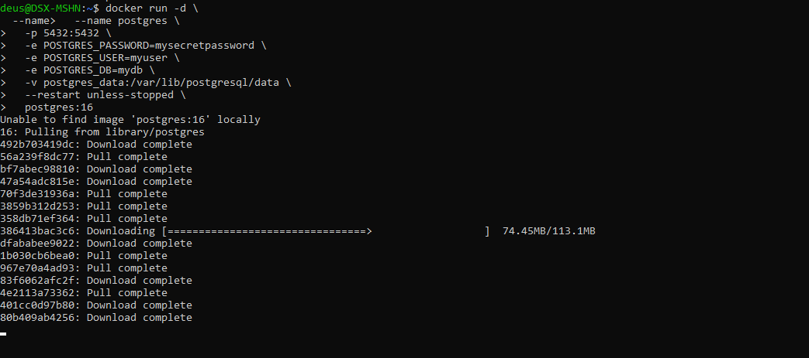
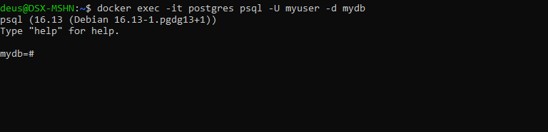
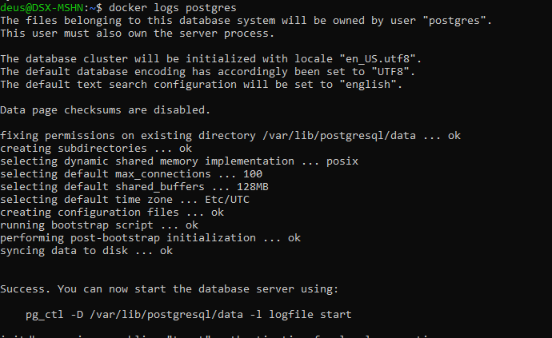
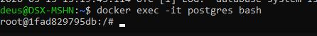

# PostgreSQL в Docker

## О проекте

**PostgreSQL** (Postgres) — мощная объектно-реляционная база данных с открытым исходным кодом. Известна своей надежностью, расширяемостью и соответствием стандартам ACID.

Особенности официального образа:

- Основан на Debian или Alpine Linux
- Поддержка различных версий (13, 14, 15, 16, 17)
- Настраивается через переменные окружения
- Тома для постоянного хранения данных
- Встроенные механизмы репликации

## Установка PostgreSQL

```bash
docker run -d \
  --name postgres \
  -p 5432:5432 \
  -e POSTGRES_PASSWORD=mysecretpassword \
  -e POSTGRES_USER=myuser \
  -e POSTGRES_DB=mydb \
  -v postgres_data:/var/lib/postgresql/data \
  --restart unless-stopped \
  postgres:16
```



### Что означают аргументы

| Аргумент | Описание |
| `-d` | Запуск в фоновом режиме |
| `--name postgres` | Имя контейнера |
| `-p 5432:5432` | Проброс порта (стандартный порт PostgreSQL) |
| `-e POSTGRES_PASSWORD=...` | Пароль для суперпользователя (обязательно) |
| `-e POSTGRES_USER=myuser` | Имя суперпользователя (по умолчанию postgres) |
| `-e POSTGRES_DB=mydb` | Создать БД при первом запуске |
| `-v postgres_data:/var/lib/postgresql/data` | Том для хранения данных |
| `--restart unless-stopped` | Автоматический перезапуск |
| `postgres:16` | Образ с тегом версии 16 |

## Переменные окружения

| Переменная | Назначение | Значение по умолчанию |
| `POSTGRES_PASSWORD` | Пароль для суперпользователя | Обязательная |
| `POSTGRES_USER` | Имя суперпользователя | postgres |
| `POSTGRES_DB` | Имя создаваемой БД | Значение POSTGRES_USER |
| `POSTGRES_INITDB_ARGS` | Аргументы для initdb | — |
| `POSTGRES_HOST_AUTH_METHOD` | Метод аутентификации | scram-sha-256 |

## Проверка работы

```bash
# Подключиться к контейнеру
docker exec -it postgres psql -U myuser -d mydb

# Или с локального клиента
psql -h localhost -p 5432 -U myuser -d mydb
```

## Полезные команды

```bash
# Просмотр логов
docker logs postgres

# Подключение к bash внутри контейнера
docker exec -it postgres bash

# Резервное копирование БД
docker exec -t postgres pg_dump -U myuser mydb > backup.sql

# Восстановление из бэкапа
cat backup.sql | docker exec -i postgres psql -U myuser -d mydb

# Остановка
docker stop postgres

# Удаление (с сохранением тома)
docker rm postgres

# Полное удаление (включая том)
docker rm -v postgres
docker volume rm postgres_data
```

## Подключение и основные команды psql

```bash
# Вход в psql
docker exec -it postgres psql -U myuser -d mydb
```

```sql
-- Посмотреть базы данных
\l

-- Переключиться на другую БД
\c mydb

-- Посмотреть таблицы
\dt

-- Посмотреть пользователей
\du

-- Информация о текущем подключении
\conninfo

-- Выйти
\q
```

## Монтирование конфигурации

```bash
# С собственным postgresql.conf
docker run -d \
  --name postgres \
  -p 5432:5432 \
  -e POSTGRES_PASSWORD=mysecretpassword \
  -v ./postgresql.conf:/etc/postgresql/postgresql.conf \
  -v postgres_data:/var/lib/postgresql/data \
  postgres:16 -c 'config_file=/etc/postgresql/postgresql.conf'
```

## Пример postgresql.conf

```ini
max_connections = 200
shared_buffers = 256MB
effective_cache_size = 768MB
maintenance_work_mem = 64MB
checkpoint_completion_target = 0.9
wal_buffers = 16MB
default_statistics_target = 100
random_page_cost = 1.1
effective_io_concurrency = 200
work_mem = 6553kB
min_wal_size = 1GB
max_wal_size = 4GB
```

## Подключение из другого контейнера

```bash
# В одной сети
docker network create postgres-network

docker run -d \
  --network postgres-network \
  --name postgres \
  -e POSTGRES_PASSWORD=mysecretpassword \
  postgres:16

# Подключение приложения
docker run -it \
  --network postgres-network \
  --name pgadmin \
  -p 5050:80 \
  -e PGADMIN_DEFAULT_EMAIL=admin@admin.com \
  -e PGADMIN_DEFAULT_PASSWORD=admin \
  dpage/pgadmin4
```

## Для разработки (быстрый старт)

```bash
# Минимальный запуск
docker run -d \
  --name postgres-dev \
  -p 5432:5432 \
  -e POSTGRES_PASSWORD=postgres \
  postgres:16

# С pgAdmin
docker run -d \
  --name pgadmin \
  -p 5050:80 \
  -e PGADMIN_DEFAULT_EMAIL=admin@admin.com \
  -e PGADMIN_DEFAULT_PASSWORD=admin \
  --link postgres:postgres \
  dpage/pgadmin4
```

## Отличия от MySQL

| Характеристика | PostgreSQL | MySQL |
| Тип СУБД | Объектно-реляционная | Реляционная |
| Соответствие ACID | Полное | Зависит от движка |
| Поддержка JSON | Отличная (JSONB) | Хорошая |
| Расширяемость | Высокая | Ограниченная |
| Репликация | Синхронная/асинхронная | Асинхронная |

## Примечания

- Для продакшена обязательно меняйте пароли
- Регулярно делайте бэкапы
- PostgreSQL чувствителен к настройкам ядра Linux для высокой нагрузки
- Рассмотрите использование Docker Compose для сложных конфигураций
- Для работы с расширениями (postgis, timescaledb) используйте соответствующие образы
