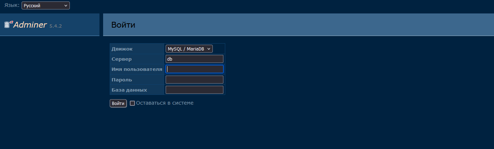
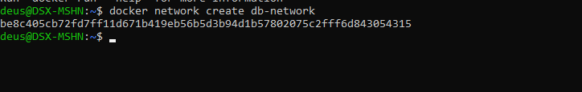

```markdown
# Adminer в Docker

## О проекте

**Adminer** (бывший phpMinAdmin) — легковесная система управления базами данных с открытым исходным кодом. Написана на PHP и поддерживает множество СУБД.

Поддерживаемые базы данных:
- MySQL / MariaDB
- PostgreSQL
- SQLite
- MS SQL
- Oracle
- Firebird
- SimpleDB
- Elasticsearch
- MongoDB

## Преимущества

- Один файл ~500KB
- Не требует установки
- Работает с любым веб-сервером с PHP
- Интуитивный интерфейс
- Безопаснее чем phpMyAdmin
- Поддержка тем оформления

## Установка Adminer

```bash
# Простой запуск
docker run -d \
  --name adminer \
  -p 8080:8080 \
  --restart unless-stopped \
  adminer:latest
```

### Что означают аргументы

| Аргумент | Описание |
|----------|----------|
| `-d` | Запуск в фоновом режиме |
| `--name adminer` | Имя контейнера |
| `-p 8080:8080` | Проброс порта (веб-интерфейс) |
| `--restart unless-stopped` | Автоматический перезапуск |
| `adminer:latest` | Образ Adminer |

## Подключение к базе данных

### Вариант 1: База данных на хосте

```bash
# Для доступа к БД на хосте используйте IP хоста
# или специальный DNS name (на Mac/Windows)
docker run -d \
  --name adminer \
  -p 8080:8080 \
  adminer:latest
```

В браузере: `http://localhost:8080`

Параметры подключения:

- **Система**: MySQL, PostgreSQL и т.д.
- **Сервер**:
  - На Linux: `172.17.0.1` (IP Docker gateway)
  - На Mac/Windows: `host.docker.internal`
  - Или IP вашего хоста в сети
- **Имя пользователя**: ваш пользователь БД
- **Пароль**: ваш пароль
- **База данных**: имя базы

### Вариант 2: База данных в другом контейнере

```bash
# Создать сеть
docker network create db-network

# Запустить MySQL
docker run -d \
  --name mysql \
  --network db-network \
  -e MYSQL_ROOT_PASSWORD=root \
  mysql:8.0

# Запустить Adminer в той же сети
docker run -d \
  --name adminer \
  --network db-network \
  -p 8080:8080 \
  adminer:latest
```

В браузере: `http://localhost:8080`

Параметры подключения:

- **Сервер**: `mysql` (имя контейнера)
- **Имя пользователя**: `root`
- **Пароль**: `root`
- **База данных**: оставить пустым или указать имя

## Готовые примеры подключения

### MySQL / MariaDB

```bash
# Запуск MySQL и Adminer вместе
docker network create my-network

docker run -d --network my-network --name mysql -e MYSQL_ROOT_PASSWORD=secret mysql:8.0
docker run -d --network my-network --name adminer -p 8080:8080 adminer:latest
```

### PostgreSQL

```bash
docker network create pg-network

docker run -d --network pg-network --name postgres -e POSTGRES_PASSWORD=secret postgres:16
docker run -d --network pg-network --name adminer -p 8080:8080 adminer:latest
```

### MongoDB (требуется специальная версия)

```bash
docker run -d --name mongo mongo:7
docker run -d --name adminer -p 8080:8080 --link mongo adminer:latest
```

## Проверка работы

```
http://localhost:8080
```

## Полезные команды

```bash
# Просмотр логов
docker logs adminer

# Остановка
docker stop adminer

# Удаление
docker rm adminer

# Запуск с темой
docker run -d \
  --name adminer \
  -p 8080:8080 \
  -e ADMINER_DESIGN=pepa-linha-dark \
  adminer:latest
```

## Доступные темы

- `pepa-linha` (светлая, по умолчанию)
- `pepa-linha-dark` (темная)
- `nette` (синяя)
- `hydra` (серая)
- `mancave` (темно-зеленая)
- `rmsoft` (светлая с синим)

## Для разработки (docker-compose.yml)

```yaml
version: '3.8'

services:
  mysql:
    image: mysql:8.0
    environment:
      MYSQL_ROOT_PASSWORD: secret
    volumes:
      - mysql_data:/var/lib/mysql
    networks:
      - db-network

  adminer:
    image: adminer:latest
    ports:
      - "8080:8080"
    networks:
      - db-network

volumes:
  mysql_data:

networks:
  db-network:
```

```bash
docker-compose up -d
```

## Примечания

- Adminer не хранит пароли, каждый раз нужно вводить заново
- Поддерживает экспорт в SQL, CSV, JSON
- Можно выполнять произвольные SQL запросы
- Для продакшена рекомендуется ограничить доступ (пароль или IP)
- Отлично подходит для разработки и администрирования

```
